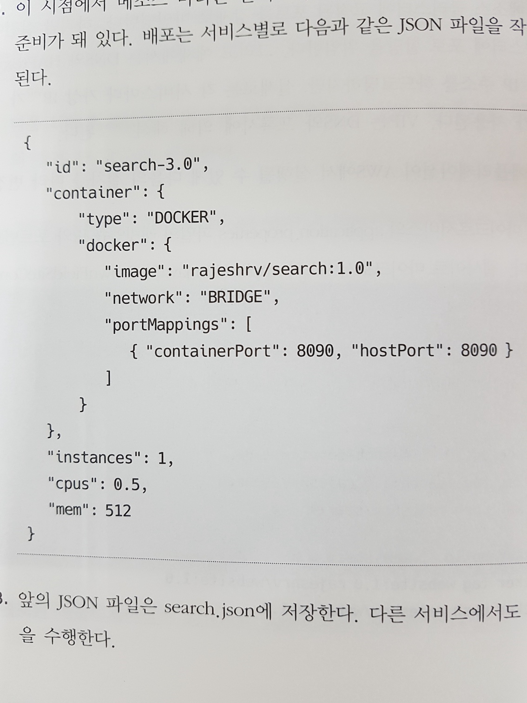

# 10장. ‘메소스와 마라톤을 이용한 도커화된 마이크로서비스 확장’

### 1 마이크로서비스 확장
마이크로 서비스를 확장하는 두가지 옵션
- 스프링 클라우드 컴포넌트를 통한 **자가등록** 및 **자가탐색** 가능
- 메서스와 마라톤을 이용한 도커화된 마이크로 서비스의 확장(**수동등록**)
#### 자동확장
서비스 사용 트래필에 따라 서비스의 인스턴스 숫자를 자동으로 증가시킨다.
자동확장에서 사용되는 조건 항목
- 자원 제약 조건 기반 확장: 자원 사용량에 따른 확장
- 특정기간 기반 확장: 업무시간, 특정 기간등에 따른 확장
- 메시지 큐 길이 기반 확장: 비동기 메시지 기반의 경우 큐의 상태에 따른 확장
- 비즈니스 파라미터 기반 확장: 비즈니스 이벤트에 따른 확장(판매마감 1시간 전)
- 예측 기반 확장: 기존이력 현재 트렌드 등을 기반한 트래픽 예측에 따른 확장
#### 잃어버린 조각
대규모 도커 배포 환경에서의 이슈 해결을 위한 솔루션의 두가지 필요 조건
- 물리적 장비나 가상머신을 일관되게 관리 할수 있는 추상화 계층 필요
- 추상화 계층 위에서 컨테이너의 확장을 지능적으로 관리할 수 있어야 함

### 2 컨테이너 오케스트레이션
대규모의 컨테이너 관리(배포, 탐색, 자원관리, 모니터링 등)를 돕는 도구
클러스터 관리, 데이터 센터 가상화, 컨테이너 스케쥴러, 데이터센터 운영체제 라고도 함
#### 중요성(필요성)
인스턴스들의 리소스 사용일 효율적이지 못할 수 있고 이로 인한 비용증가 발생
- 효율적으로 컨테이너를 인프라에 자동 할당 해야함
- 애프리케이션 배포시 인프라 종류에 종속되지 않아야 함
- 배포물에 대한 규칙, 제약 적용
- 가용한 자원을 최대한 효율적으로 사용하고, 관리 비용이 최소가 되야 함
#### 하는 일
- 오케스트레이션: 여러 장비(이기종 장비, 여러 데이터센터 포함가능)들을 묶어 가상의 클러스터 제공
- 배포: 어플리케이션이나 컨테이너의 배포를 자동화, 배포 롤백도 가능
- 확장성: 어플리케이션 인스턴스의 수동/자동 확장 가능
- 실행상태 관리: 클러스터, 노드 및 애플리케이션의 실행 상태를 관리
- 인프라스트럭처 추상화: 애플리케이션의 배포 실행이 어느 인프라에서 되는지 개발자는 알필요 없음
- 자원 최적화: 여러 인프라를 효율적으로 사용 가능
- 자원 할당: 개발자 정의 제약사항, 친화도, 포트, 애플리케이션 의존관계에따라 자원 할당
- 서비스 가용성: 애플리케이션이 실행 중인 인프라에 장애가 발생하면 다른 인프라로 옮겨서 재시작 한다
- 애자일성: 자원 요규량 변화에 신속히 대처
- 격리: 자원은 서로 분리되어 있다

#### 자원할당
- 스프레드: 인프라 사이에 균등하게 할당
- 빈 패킹: 순차적으로 인프라를 채워 나감
- 랜덤: 무작위로 배포
#### 마이크로서비스와의 관계
마이크로서비스의 효율적인 인프라 사용을 위해 오케스트레이션이 반드시 필요하다
#### 가상화와의 관계
가상서버나 물지 장비를 모두 하나로 추상화 할수 있다.
#### 컨테이너 오케스트레이션 솔루션
- 도커스웜: 도커의 네이티브 오케스트레이션 솔루션이다. 빈패킹 알고리즘과 스프레드 알고리즘을 사용한다. 도커 컨테이너만 지원한다.
- 쿠버네티스: 배포자동화, 배포물의 버전관리, 컨테이너 복원 등의 여러 기능을 사용하기 쉽게 제공한다. 하지만 도커 스웜에 비해 배우기가 어렵다.
- 아파치 메소스: 인프라 자원 관리를 하는 분산 시스템 커널이다. 스웜, 쿠버네티스와 다르게 작업 실행 관리는 다른 프레임워크(마라톤, 크로노스, 오로라)에 의존한다. 마라톤은 도커 컨테이너뿐 아니라 컨테이너화되지 않은 애플리케이션도 지원한다. 마라톤 안에서는 스프링 부트를 직정 설정 가능하다. 마라톤은 애플리케이션 의존관계 지원, 서비스의 확장 및 업그레이드를 위한 애플리케이션 그룹핑, 인스턴스 실행 및 비정상 인스턴스 종료, 점진적 배포 및 원상 복구 기능 지원
- 해시코프 노매드: 사용자에 특화된 제약사항 정의를 지원 한다. 모든작업이 관리되는 서버이다. task가 있고 이를 그룹지을 수 있으며 job단위로 관리할 수 있다.
- 코어OS 플릿: 애플리케이션 의존 관계를 관리할 수 있다.
### 3 메소스와 마라톤을 이용한 컨테이너 오케스트레이션
메소스는 트위터, 에어비앤비, 애플, 이베이, 넷플릭스, 페이팔, 우버 등 많은 조직에서 사용되고 있다.
#### 메소스 자세히 알아보기
하나의 노드에서 다수의 태스크를 실행하기 위해 메소스는 자원격리 개념을 사용한다.
배치성 작업 부하와 OLTP성 작업 부하 모두를 처리할 수 있다.

<아키텍처>
- Master: Agent에서 여유 자원정보를 얻고 이를 Framework에게 제공하여 Task 수행을 중계한다. Master는 ZooKeeper를 통해 가용성을 확보한다.
- Agent: 클러스터의 노트에서 실행 되며, 해당 노드의 자원상태를 Master에 보고하거나, Task(프로세스, Container)에 지정된 자원을 Framework를 통해 할당한다.
- Framework
  - Scheduler: Task에 필요한 자원 정보를 포함하여 Master에게 Task 실행을 요청한다.
  - Executor: 지정된 자원을 가지고 Task를 실행 한다.
  > 참조:
  [BVLog]http://devbv.com/2017/04/12/mesos/
  [Apache MESOS]http://mesos.apache.org/documentation/latest/architecture/

메소스가 지원하는 프레임워크
- 마라톤, 오로라: 웹 애플리케이션처럼 오래 실행되는 프로세스
- 하둡, 스파크, 스톰: 빅데이터 프로세싱
- 크로노스, 젠킨스: 배치 스케줄링
- 카산드라, 일래스틱서치: 데이터 관리

####마라톤
스칼라로 작성됐으며, 확장성이 매우 좋다. REST API 및 시작, 종료, 확장, 모니터링을 위한 UI를 제공한다.
메소스와 동일하게 주키퍼를 사용한 고가용성을 확보한다.
- 자원제약 사항 설정
- 확장, 축소, 인스턴스 관리
- 애플리케이션 버전, 시작 종료 관리
- 점진적 업그레이드, 점진적 재시작
- 블루/그린 배포(다운타임 없는 배포)
### 4 DCOS로 메소스 마라톤 구현
로드 밸런싱과 DNS 서비스를 쉽게 적용할 수 있다. (코드수준 제어는 스프링 클라우드 사용)
#### 스프링 클라우드 방식과 DCOS방식의 차이점
- 컨피그
  - 스프링 클라우드: 클라우드 컨피그
  - DCOS: 클라우드컨피그나 스프링 프로파일, 퍼펫 사용
- 서비스탐색 및 LB
  - 스프링 클라우드: 유레카, 줄
  - DCOS: 메소스 DNS, VIPs, HAProxy기반의 마라톤 로드 밸런싱 컨포넌트 사용
- 로깅 및 모니터링
  - 스프링 클라우드: 스프링 부트 액추에이터, 슬루스, 히스트릭스
  - DCOS: 다양한 로그 집계 및 지표수직 기능 제공

### 5 브라운필드 마이크로서비스에 메소스와 마라톤 적용
메소스와 마라톤을 설치해 본다.

### 6 브라운필드 PSS 서비스 준비
교제에 소개된 PSS 예제에 메소스와 마라톤을 적용해 본다.
어플리케이션 배포시 제약사항을 JSON 형태로 작성한다.

</img>
- id: 애플리케이션 식별 값
- cpus, mem: 애플리케이션 제약사항, 이 조건을 충족하지 못하면 마라톤은 앱실행을 하지 않는다
- instances: 애플리케이션이 몇개의 인스턴스로 시작될지 결정
- container: container 유형과 관련 이미지 정보를 제공
- image: 어떤 도커 이미지를 사용해 배포할지 마라톤에게 알려 줌
- network: 도커의 네트워크 유형을 지정
- portMappings: 포워딩을 위한 포트 매핑 정보를 제공
