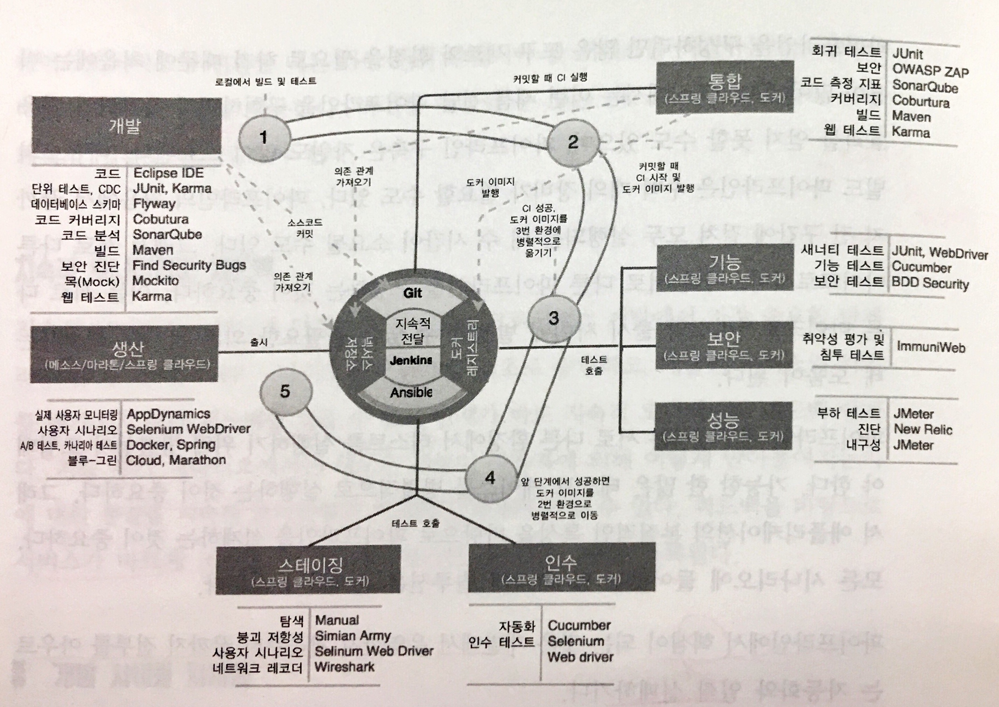

# 11장. '마이크로서비스 개발 라이프사이클'

### 비아키텍처적인 면

비즈니스 동기 및 가치에 대한 이해
- 화려한 아키텍처 추구 X
- 마이크로서비스 사용을 통한 비즈니스 가치 실체화되야함

프로젝트에서 제품 개발로의 사고방식 전환
- 마이크로서비스를 사용함으로써 얻는 비즈니스 역량은 제품으로 나타나야함
- 제품 개발팀이 소유권과 책임감을 가짐 : 품질향상, 변경, 배포, 기술 지원, 유지보수 책임

개발 철학
- 조직에 맞는 접근 방식 선택
- 디자인 사고, 애자일, 스타트업 모델

> 디자인 사고

> 명확하게 정리되지 않은 사용자의 니즈를 이해하고, 이를 해결할 수 있는 기회를 찾아 내기 위해 공감적 태도를 활용하는 일종의 복잡한 문제 해결에 대한 논리추론적 접근법

MVP
- 실행가능한 최소한의 제품(Minimum Viable Product)이란, 팀이 최소한의 노력으로 고객에 대한 최대한 많은 유효한 정보를 학습할 수 있게 해주는 새로운 버전의 제품이다. - Eric Ries

레거시 난관 극복
- 마이크로서비스 개발은 레거시와 보조를 맞춰야함
- 쉬운 해결방법 없음. 레거시 시스템에 집중, 투자, 경영진의 개입 등을 통해 부하 줄여야 함

자기 조직화 팀의 구성
- 작고 집중적인 팀(10명 이내, 피자 2개팀 - 제프 베조스)
- 마이크로서비스별로 하나의 전담 팀 구성이 이상적 (동일 비즈니 영역내의 여러개의 마이크로서비스 전담 팀 구성도 가능)
- 팀이 아이디어 도출, 분석, 개발, 운영에 대한 소유권 소유(만드는 것도 당신, 운영하는 것도 당신 - 베르너 보겔스), 자율성 보장
- 풀스택 개발자, 운영 엔지니어 포함
- 특별한 기술은 컨설턴트 활용
- 의사소통과 투명성 매우 중요
- 팀 리드, UX 관리자, 개발 관리자, 테스트 관리자 등 세밀한 파트 나누지 않음
- 엔터프라이즈 아키텍처와 보안은 시작부터 공개적으로 공유하여 제품 개발 과정에서의 일탈 예방
- 팀간의 통합은 대규모 인터페이스 문서보다는 테스트 스크립 형태의 소비자 주도 계약(Consumer-Driven Contracts)으로 수행, 타 서비스 사용불가능한 경우 mock 서비스 사용

> [Spring Cloud Contract 소개](https://cloud.spring.io/spring-cloud-contract/)

> [Consumer Driven Contracts Getting Started with Spring Cloud Contract](https://spring.io/guides/gs/contract-rest/)

클라우드 환경 구축

마이크로서비스 생태계 구축
- 서비스 등록, 탐색
- API 게이트 웨이
- 외부화된 설정
- 중앙집중화된 로깅, 모니터링 등

개발 라이프사이클 프로세스로서의 DevOps
- 지속적 통합(CI, Continuous Integration)
- 지속적 전달(CD, Continuous Delivery)
- 지속적 배포(Continuous Deployment)
- 어플리케이션 출시 자동화(ARA, Application Release Automation)

가치 주도 계획
- 비즈니스에 가장 높은 가치를 가져다 주면서 위험도는 가장 낮은 요구 사항 식별

지속적 모니터링과 피드백
- 지속적 모니터링 - 피드백 - 서비스 개발 사이클

### 개발 사이클 자동화

[Screenplays and Journeys 소개 - 인수 테스트](http://testerstories.com/2016/06/screenplays-and-journeys-not-page-objects/)

[DevOps Tools 주기율표](https://xebialabs.com/periodic-table-of-devops-tools/)

[DevOps Tool Chest](https://xebialabs.com/the-ultimate-devops-tool-chest/)
