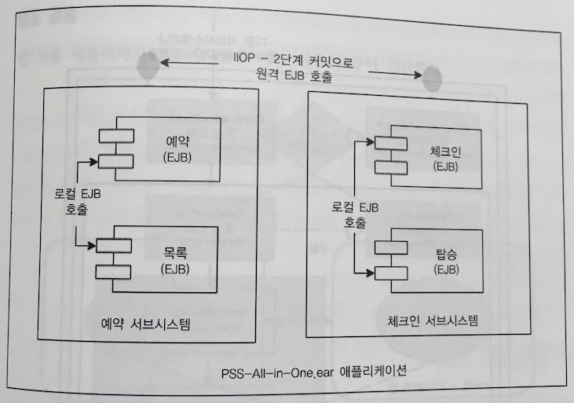
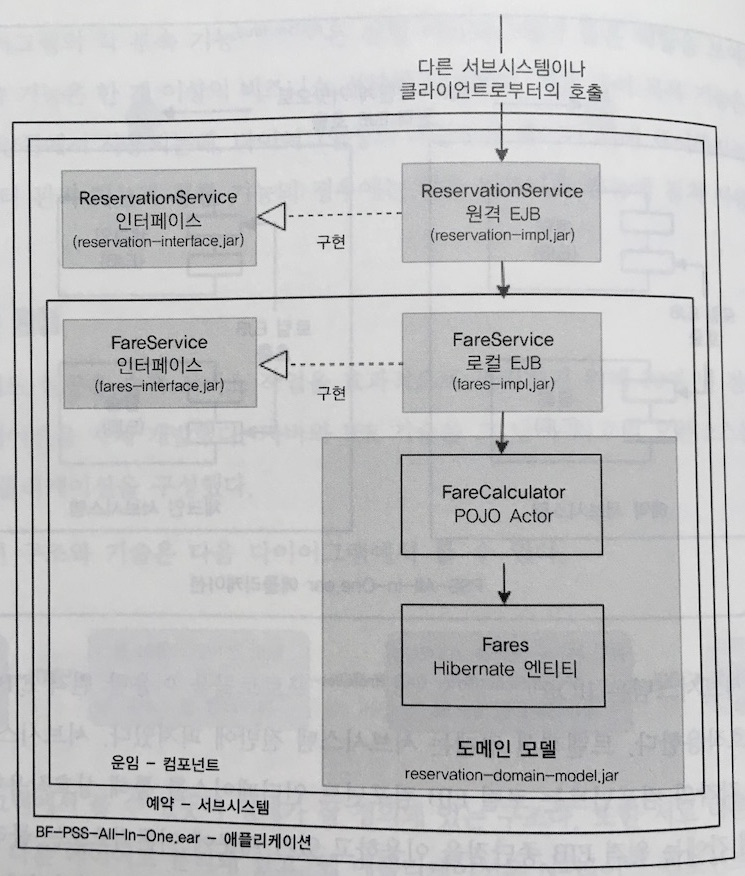
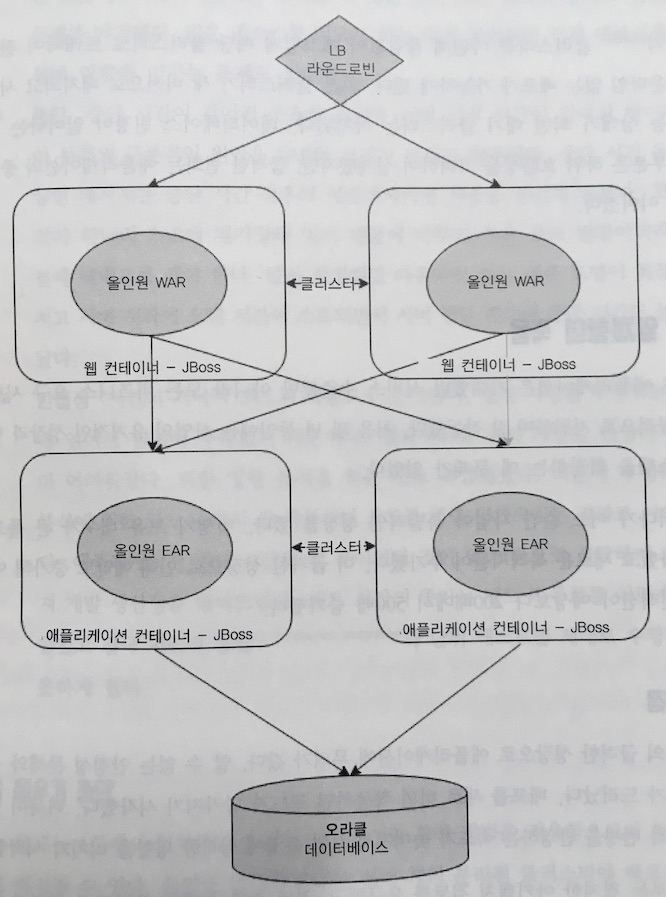
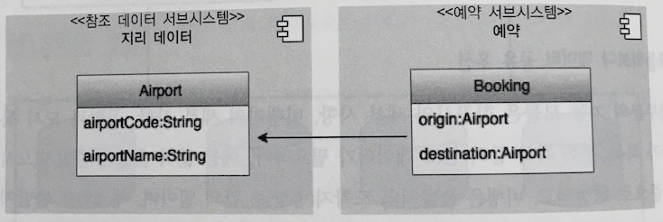
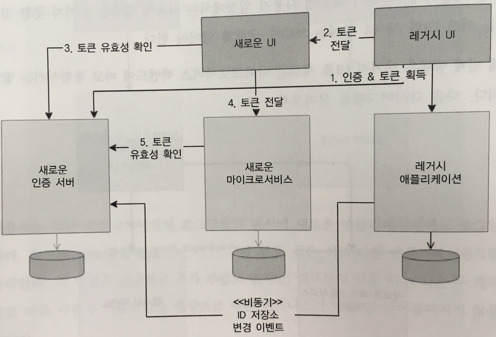
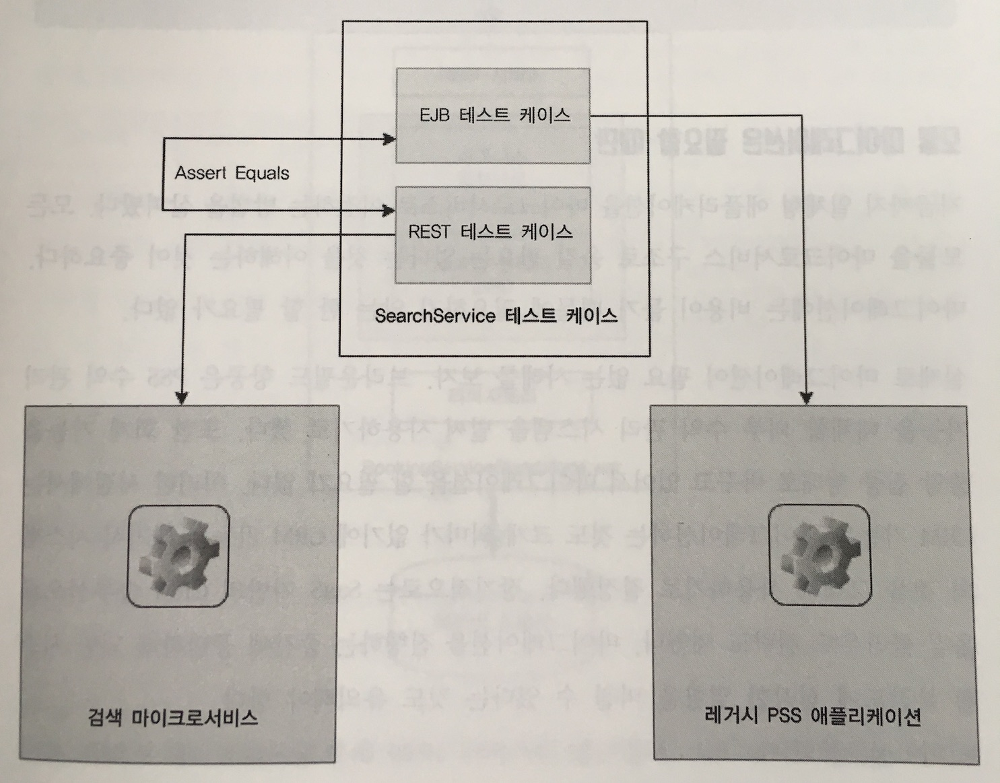
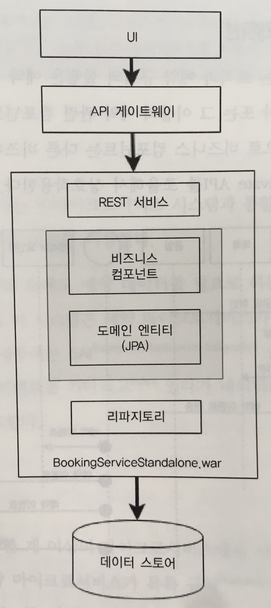

# 6장 마이크로서비스의 진화: 사례 연구

- 브라운필드 항공: 일체형 -> 마이크로서비스
- 마이그레이션 방법 및 전략

## PSS 애플리케이션의 이해

PSS
> Passenger Sales and Service - 여객 판매 & 서비스

브라운필드 항공
- 빠르게 성장하는 스타트업 저가 항공사
- 100곳 이상의 목적지에 운행할 정도로 성장
- 자체 개발한 PSS 시스템

### 비지니스 절차적 관점

- 내부 작업
  - 비행 전: 비행 스케줄, 비행기 배정 등을 준비하는 계획 단계
  - 비행 후: 수익 관리, 회계 등을 위해 백 오피스에서 사용
- 고객 작업
  - 검색
  - 예약
  - 체크인

### 기능적 관점

- 검색 기능: 검색, 비행, 운임
- 예약 기능: 예약, 목록, 결제
- 체크인 기능: 체크인, 탑승, 좌석, 수화물, 멤버십
- 백오피스 기능: CRM, 데이터 분석, 수익 관리, 회계
- 데이트 관리 기능: 참조 데이터, 고객
- 공통 기능: 이용자 관리, 알림

### 아키텍처 관점

- Web browser
- JSP / EJB / Hibernate
- Oracle

### 설계 관점


- 여러 개의 논리적인 기능 그룹, 서브시스템을 갖고 있음
- 물리적으로 분리된 서버에서 각 서브시스템을 운영할 수 있게 설계함

### 구현 관점


- 회색 박스는 서로 다른 메이븐 프로젝트
- 구현보다 인터페이스에 중점을 두고 설계
- 모든 서브시스템은 하나의 EAR로 패키징되어서 배포

### 배포 관점


- 웹, 비지니스 모듈은 서로 다른 서버 클러스터에 배포
- 대기 클러스터를 두어서 다운타임 없는 배포 가능
- DB 변경을 고려해 설계 했지만, 급격한 변화는 서비스 중단으로 이어짐

## 일체형의 죽음

- 모든 비지니스 요구 사항을 성공적으로 지원하면 잘 작동
- 급격한 성장으로 인해 예약 트랜잭션이 예상보다 200배 ~ 500배 증가함

### 문제점

- 안정성
  - DB 테이블 락 때문에 스레드가 멈춤
  - 메모리 문제
  - 리소스를 많이 필요로 하는 특정 작업들이 전체 시스템에 영향을 미침
- 중단
  - 서버 시작 시간이 길어짐: EAR의 크기가 커짐
  - 하나의 EAR로 패키징 되어 있기 때문에 작은 코드 변경에도 전체 재배포가 필요
  - 서버 중단 횟수와 시간이 늘어남
- 민첩성
  - 변경 사항을 구현하는데 있어서 원칙이 부족해서 코드 복잡도 증가
  - 빌드 시간이 길어짐 -> 생산성 저하 -> 빌드 자동화 어려워짐 -> CI, 단위테스트를 제대로 수행하지 못함

### 간극 메우기

- ...?

### 회고

- 시스템은 잘 설계 되어있었음
- 결합도는 낮고, 표준 인터페이스를 통해 접근하는 방식으로 설계, 도메인 모델도 풍부

#### 모듈화보다 데이터 공유 우선

- 대부분의 기능 모듈은 항공사/비행가의 세부사항, 각종 목록 등 여러 참조 데이터가 필요
- 참조 데이터에 대해서는 공유 라이브러리로 사용하는 방식을 적용
  

#### 일체형 단일 데이터베이스

  - 네이티브 쿼리
    - 다른 서브시스템이 소유한 테이블을 연결
    - 컴포넌트 간의 결합도가 높아짐
    - 문서화되지 않은 찾기 힘들 코드들이 생겨남
  - 저장 프로시저
    - 데이터 중심의 복잡한 로직 중 일부는 느린 응답, 메모리 문제, 스레드 블로킹 문제를 야기함
    - 비지니스 로직을 저장 프로시저에 직접 담아 데이터베이스 계층에서 구현하여 문제 해결
    - 애플리케이션의 모듈성이 깨짐
  - 도메인 경계 침범
    - 모든 컴포넌트가 하나의 EAR 파일로 패키징
    - 컴포넌트간 객체를 참조해도 아무런 문제가 되지 않음
    - 복잡도 증가 및 애플리케이션 모듈성이 사라짐

## 마이크로서비스 구조대: 계획적 마이그레이션

- 혁명적인 모델보다는 진화적인 접근 방식으로 시스템을 새로 정립
- 특정한 사용자 커뮤니티를 타게팅해서 여러 개의 웹 애플리케이션을 만드는 전략
- 모델링의 유연함, 서로 다른 사용자 커뮤니티를 다르게 처리할 수 있음

### 비지니스 사례

- 서비스 의존성
- 물리적 경계
- 선택적 확장
- 기술 노후화

### 마이그레이션 방식

- 전환 계획을 수립하고, 전짐적으로 기능을 마이크로서비스에 옮기는 것이 중요
- 마이크로서비스는 일체형 애플리케이션의 외부에서 만들어지고, 새 서비스로 전환

```
- 마이크로서비스 경계 식별
- 마이그레이션을 위한 마이크로서비스 우선순위 지정
- 전환 단계에서의 데이터 동기화 처리
- 이전의 UI와 새로운 UI를 다루기 위한 사용자 인터페이서 통합
- 새로운 시스템에서의 참조 데이터 처리
```

### 마이크로서비스 경계 식별

- 서비스 지향 아키텍처에서와 같이 서비스를 분해해보는 것이 좋은 방법
- 분해 단계를 거치면 잠재적인 마이크로서비스의 목록이 나온다.

### 의존 관계 분석

#### 쿼리와 대조되는 이벤트

- 확장 가능한 시스템에서는 이벤트 기반 의존 관계가 더 낫다.
- 기존에 호출을 하는 모듈이 변경이 있을 때마다 이벤트를 발행하고, 호출 당하는 모듈은 이벤트를 구독하는 방식
- 하지만 이벤트 발행-구독 패턴이 비효율적인 경우도 있음
- 모든 시나리오에 적용할 수 있는 단 하나의 정책은 없다.

#### 동기적 업데이트와 대조되는 이벤트

- 시작점이 되는 서비스가 상태 변경이 일어날 때마다 이벤트를 발행하는 방법
- 이 이벤트를 필요로 하는 어떤 모듈이든 이벤트 스트림을 구독
- 이 방법은 시스템 결합도를 낮춰준다.

#### 까다로운 요구 사항

- 요구 사항을 다시 살펴보면 목표했던 상태를 대부분 충족시킬 수 있다.

#### 까다로운 서비스 경계

### 마이그레이션을 위한 마이크로서비스 우선순위 지정

우선순위 분석 및 마이그레이션 순서 정하기

- 의존 관계
  - 의존 관계가 복잡할수록 마이그레이션의 위험성이 높아진다.
- 트랜잭션 크기
  - 트랜잭션이 큰 서비스를 마이크레이션하는 것은 현재 시스템의 로드를 줄여준다.
  - 그러나 위험 부담이 큼
- 리소스 이용률
  - 리소스를 많이 사용하는 서비스를 마이그레이션하면 남은 서비스들의 기능이 더 잘 작동할 수 있다.
- 복잡도
  - 복잡도가 낮을수록 마이그레이션하기가 훨씬 쉽다.
- 사업 중요도
- 변경 속도
  - 변경 요구가 잦은 모듈은 안정적인 모듈에 비해 더 좋은 마이그레이션 후보다.
- 혁신

검색 기능
> 혁신이 필요하고 변경 속도가 빠르며, 사업 중요도가 상대적으로 낮고 사업 부문과 IT 부분 모두에게 긍정적 영향을 미칠 수 있기 때문에 우선순위가 가장 높다.

> 레거시 시스템과 데이터를 동기화할 필요가 없기 때문에 의존성도 매우 낮다.

### 마이그레이션 중의 데이터 동기화

- from 레거시 시스템: 비동기 이벤트로 새로운 서비스에 데이터를 제공
- to 레거시 시스템: 비동기 이벤트로 레거시 시스템에 데이터를 제공 + 이벤트를 받아 업데이트를 담당하는 컴포넌트를 새로 만들어 기존의 레거시 모듈에 변경이 없게
- 상황에 맞는 여러 가지 방법으로 마이그레이션을 진행

### 참조 데이터 관리

- 참조 데이터를 그 제체로 하나의 마이크로서비스로
- 각 서비스에 대해 캐시 생성, 참조 데이터에 접근할 때는 프록시 라이브러리 사용
- 캐시를 IMDG 사용

### 사용자 인터페이스와 웹 애플리케이션

- 이전 UI와 새로운 UI 사이에 연결 고리 없이 분리된 사용자 애플리케이션으로 만드는 방법
  - 간단하고 추가 부담이 없음
  - 서로 다른 사용자 커뮤니티를 대상으로 하는 비지니스가 아닌 한 받아들여지기 힘듦
- 레거시 UI를 주 애플리케이션으로 사용하고 사용자가 새로운 애플리케이션의 페이지를 요청하면 새로운 UI로 페이지 이동
  - 사용자 입장에서 사용에 끊김을 느끼지 못함
  - 통합 SSO가 구현되어 있어야 함
- 레거시 UI를 새로운 마이크로서비스 백엔드에 바로 통합시키는 방법
  - 새로운 마이크로서비스가 화면이 없는 애플리케이션으로 구성되어 있는 경우

#### 세션 관리 및 보안



### 테스트 전략

- 통합 테스트 케이스는 마이그레이션이나 리팩토링 전에 작성되어야 한다.
- 자동 회귀 테스트 패키지 필요



### 생태계 역량 구축

- 여러 기능들이 실제로 필요할 때까지 개발을 미루면서 점진적으로 구축해나가는게 효과적이다.

### 모듈 마이그레이션은 필요할 때만

- 모든 모듈을 마이크로서비스 구조로 옮길 필요는 없다.
- 마이그레이션에는 비용이 든다.

### 마이크로서비스의 내부 계층 구조



### 마이크로서비스 오케스트레이션

- ...?

### 다른 시스템과의 통합

- 마이크로서비스와 非마이크로서비스 시스템의 통합은 API 게이트웨이나 신뢰할 만한 메시지 버스를 이용

### 공유 라이브러리 관리

- 일부 비지니스 로직은 한 개 이상의 마이크로서비스에서 사용되며, 공유 라이브러리 형태로 각 마이크로서비스에 중복으로 존재할 수도 있다.

### 예외 처리

- 예외 메시지를 사용자에게 던져서 재시도를 유도: 가장 간단하지만 사용자가 불편함을 느낌
- 시스템 내부에서 여러 방법으로 해결: 시스템의 복잡도가 높아짐
- 트레이드오프 분석을 통해 주어진 상황에서 최선의 선택지를 찾아야함
